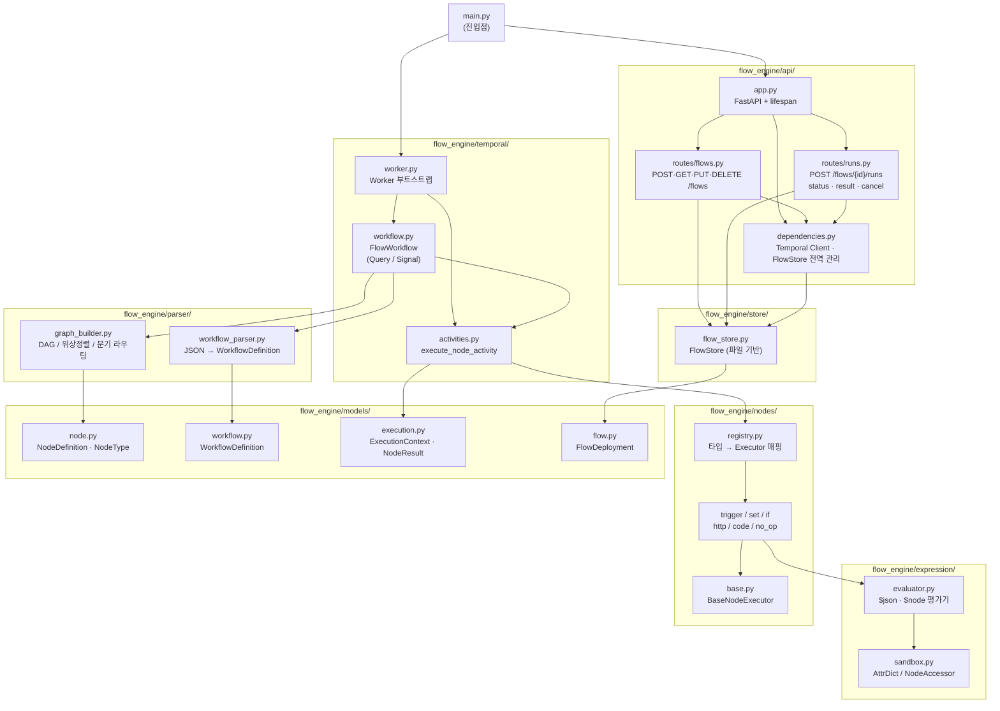
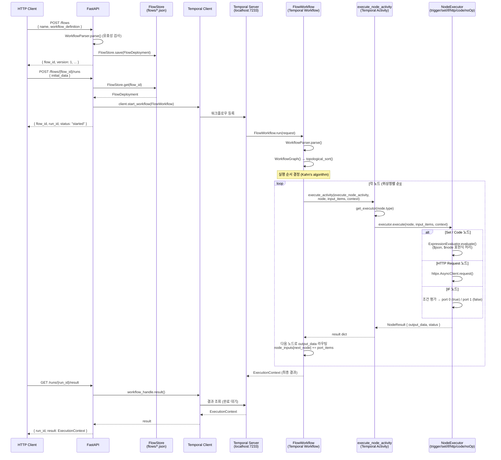

# tempral-integration-data-plane

n8n 스타일의 워크플로우 JSON을 [Temporal.io](https://temporal.io/) 위에서 실행하는 Flow Engine입니다.

## 개요

JSON으로 정의된 노드 DAG를 **배포(Deploy)** 하고 **실행(Run)** 하는 두 단계로 동작합니다. 배포된 flow 정의는 파일로 저장되며, 실행 시 저장된 정의를 읽어 각 노드를 Temporal Activity로 실행합니다. 노드 간 데이터 라우팅, `$json`/`$node` 표현식 평가, 실행 상태 조회 및 취소 API를 제공합니다.

```
POST /flows                    →  flow 정의 저장 (flow_id 반환)
POST /flows/{flow_id}/runs     →  FlowWorkflow (Temporal)
                                     └─ topological sort
                                     └─ execute_node_activity × N
                                     └─ 노드 간 데이터 라우팅
```

## 요구사항

- Python 3.11+
- [Temporal Server](https://docs.temporal.io/cli#start-dev-server) (로컬 실행용)

## 설치

```bash
pip install -e .

# 개발 의존성 포함
pip install -e ".[dev]"
```

## 실행

Temporal 로컬 서버를 먼저 시작합니다.

```bash
temporal server start-dev
```

이후 모드를 선택하여 실행합니다.

```bash
python main.py worker   # Temporal Worker만 실행
python main.py api      # FastAPI 서버만 실행 (port 8000)
python main.py both     # Worker + API 동시 실행
```

## API

### Flow 배포 (Deploy)

| Method | Path | 설명 |
|--------|------|------|
| `POST` | `/flows` | 새 flow 배포 → `flow_id` 반환 |
| `GET` | `/flows` | 배포된 flow 목록 |
| `GET` | `/flows/{flow_id}` | flow 정의 조회 |
| `PUT` | `/flows/{flow_id}` | flow 정의 교체 (hot-deploy) |
| `DELETE` | `/flows/{flow_id}` | flow 삭제 |

#### flow 배포

```bash
curl -X POST http://localhost:8000/flows \
  -H "Content-Type: application/json" \
  -d '{
    "name": "My Workflow",
    "workflow_definition": {
      "name": "My Workflow",
      "nodes": [...],
      "connections": {...}
    }
  }'
```

응답:

```json
{
  "flow_id": "flow-a1b2c3d4",
  "name": "My Workflow",
  "workflow_definition": {...},
  "version": 1,
  "created_at": "2026-03-04T00:00:00Z",
  "updated_at": "2026-03-04T00:00:00Z"
}
```

#### Hot-deploy (재시작 없이 정의 교체)

```bash
curl -X PUT http://localhost:8000/flows/flow-a1b2c3d4 \
  -H "Content-Type: application/json" \
  -d '{"workflow_definition": {...새 정의...}}'
```

- 파일만 교체되므로 worker 재시작 불필요
- 이미 실행 중인 run에는 영향 없음 (Temporal 내부에 정의가 캡처됨)
- 다음 run부터 새 정의 적용 (version +1)

### Flow 실행 (Run)

| Method | Path | 설명 |
|--------|------|------|
| `POST` | `/flows/{flow_id}/runs` | 배포된 flow 실행 → `run_id` 반환 |
| `GET` | `/runs/{run_id}/status` | 실행 상태 조회 |
| `GET` | `/runs/{run_id}/result` | 실행 결과 조회 (완료 대기) |
| `POST` | `/runs/{run_id}/cancel` | 실행 취소 |

#### flow 실행

```bash
curl -X POST http://localhost:8000/flows/flow-a1b2c3d4/runs \
  -H "Content-Type: application/json" \
  -d '{"initial_data": [{"name": "World"}]}'
```

응답:

```json
{"flow_id": "flow-a1b2c3d4", "run_id": "run-e5f6g7h8", "status": "started"}
```

#### 상태 및 결과 조회

```bash
GET /runs/{run_id}/status
GET /runs/{run_id}/result
POST /runs/{run_id}/cancel
```

## 워크플로우 JSON 형식

n8n 워크플로우 JSON 구조를 따릅니다.

```json
{
  "name": "Sample Workflow",
  "nodes": [
    {
      "id": "1",
      "name": "Start",
      "type": "n8n-nodes-base.manualTrigger",
      "parameters": {}
    },
    {
      "id": "2",
      "name": "SetGreeting",
      "type": "n8n-nodes-base.set",
      "parameters": {
        "values": {
          "string": [
            {"name": "greeting", "value": "={{ \"Hello \" + $json.name }}"}
          ]
        }
      }
    }
  ],
  "connections": {
    "Start": {
      "main": [[{"node": "SetGreeting", "type": "main", "index": 0}]]
    }
  }
}
```

## 지원 노드 타입

| 타입 | 설명 |
|---|---|
| `n8n-nodes-base.manualTrigger` | 시작 트리거, `initial_data` 주입 |
| `n8n-nodes-base.set` | 필드 추가/덮어쓰기 (`string`, `number`, `boolean`) |
| `n8n-nodes-base.httpRequest` | HTTP 요청 (item당 1건, httpx 사용) |
| `n8n-nodes-base.if` | 조건 분기 (port 0 = true, port 1 = false) |
| `n8n-nodes-base.noOp` | pass-through |
| `n8n-nodes-base.code` | sandboxed Python 코드 실행 |

## 표현식

`={{ ... }}` 형식으로 노드 파라미터 내에서 표현식을 사용할 수 있습니다.

| 표현식 | 설명 |
|---|---|
| `={{ $json.fieldName }}` | 현재 처리 중인 item의 필드 접근 |
| `={{ $json.a + " " + $json.b }}` | 문자열 연결 등 연산 |
| `={{ $node['NodeName'].json.field }}` | 이전 노드 결과 참조 |

## 구성도



## 호출 흐름도



## 프로젝트 구조

```
tempral-integration-data-plane/
├── pyproject.toml
├── main.py                         # 진입점 (worker / api / both)
│
├── flows/                          # 배포된 flow 정의 저장소 (자동 생성)
│   └── flow-{id}.json
│
├── flow_engine/
│   ├── models/
│   │   ├── node.py                 # NodeDefinition, NodeType
│   │   ├── workflow.py             # WorkflowDefinition
│   │   ├── execution.py            # ExecutionContext, NodeResult
│   │   └── flow.py                 # FlowDeployment
│   │
│   ├── store/
│   │   └── flow_store.py           # 파일 기반 FlowStore
│   │
│   ├── parser/
│   │   ├── workflow_parser.py      # JSON → WorkflowDefinition
│   │   └── graph_builder.py       # DAG 구성, 위상정렬, 분기 라우팅
│   │
│   ├── expression/
│   │   ├── evaluator.py           # $json, $node 표현식 평가기
│   │   └── sandbox.py             # AttrDict, NodeAccessor
│   │
│   ├── nodes/
│   │   ├── base.py                # BaseNodeExecutor
│   │   ├── trigger.py
│   │   ├── set_node.py
│   │   ├── http_request.py
│   │   ├── if_node.py
│   │   ├── no_op.py
│   │   ├── code_node.py
│   │   └── registry.py
│   │
│   ├── temporal/
│   │   ├── activities.py          # execute_node_activity
│   │   ├── workflow.py            # FlowWorkflow (Query/Signal)
│   │   └── worker.py
│   │
│   └── api/
│       ├── app.py
│       ├── dependencies.py        # Temporal Client · FlowStore 전역 관리
│       └── routes/
│           ├── flows.py           # POST·GET·PUT·DELETE /flows
│           └── runs.py            # /flows/{id}/runs · /runs/{id}/...
│
└── tests/
    ├── fixtures/
    │   ├── sample_workflow.json
    │   └── n8n_sample.json
    ├── test_flows_api.py
    ├── test_parser.py
    ├── test_expression.py
    └── test_nodes.py
```

## 테스트

```bash
pytest tests/ -v
```

## 의존성

- [temporalio](https://github.com/temporalio/sdk-python) — Temporal Python SDK
- [fastapi](https://fastapi.tiangolo.com/) — REST API
- [pydantic](https://docs.pydantic.dev/) v2 — 데이터 모델 및 직렬화
- [httpx](https://www.python-httpx.org/) — 비동기 HTTP 클라이언트
- [simpleeval](https://github.com/danthedeckie/simpleeval) — 표현식 평가
- [uvicorn](https://www.uvicorn.org/) — ASGI 서버
